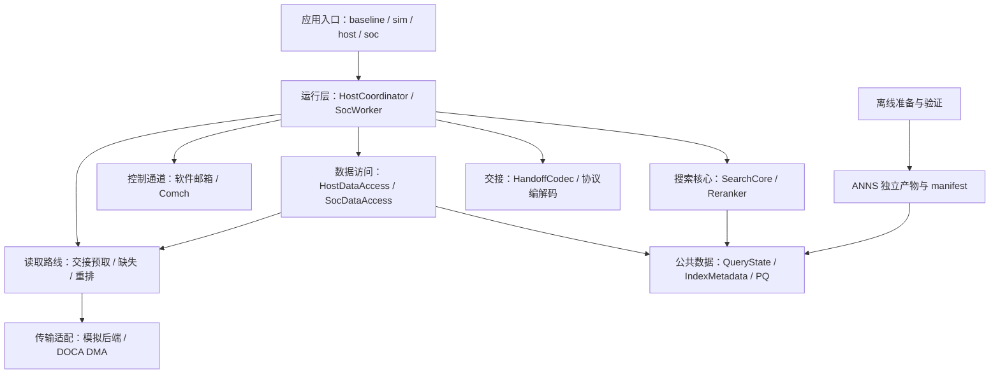

# ANNS v1 程序设计框架

日期：2026-09-27。该方案提出后，用户以“执行计划”授权实现；无设备阶段已完成，见 [实施报告](docs/implementation_report_v1.md)。下文保留实现前的设计说明与原始阶段表述。

本文件把 [正式实施计划](implementation_plan_v1.md) 细化为程序结构，供实现前审阅。已阅读 ANNS 中全部 13 份原有 Markdown；阅读记录见 [notes](planning/program_design/notes.md)。本轮仅新增 Markdown，不创建源码、安装依赖、转换数据或运行实验。

## 1. 设计结论与范围

建议采用 **共享搜索核心 + Host/SoC 两端调度 + 独立控制通道和读取后端**。搜索算法只操作图 ID、候选、visited、PQ 与邻接视图；Host/SoC 负责在哪里执行、何时取数与交接；DOCA 只负责消息、内存暴露和异步传输。

v1 为 BlueField-2、单在途查询、SoC 单 worker。状态与全部预测簇数据就绪后续搜；结果随完成消息返回。三类读取路线分别是交接/预取、缺失补读、重排取向量，首版各用 DMA。常驻 PQ 编码与逐查询 LUT 分开，图 ID 与数据集 ID 的转换集中在向量访问和结果输出边界。

`planning/v1_decisions.md` 的已确认要求优先于旧讨论稿；正式计划中的 C++17、SIFT-1M、uint8 visited、默认搜索参数继续作为工程建议。`prompt.md` 中环队列、RDMA 首版路径及 BF3 背景不覆盖后续 BF2 v1 决策。

本方案不扩展 v1 功能范围：RDMA、共享环、多查询并发、跨查询簇复用/驱逐和自动重放均后置。这里列出的类名、文件名与方法职责是待审阅的设计，不是已经实现的 API。

## 2. 分层与模块拆分



箭头表示调用或数据依赖，不表示每个框都必须是单独的库。基础统计在这些边界记录，不参与搜索决策。

| 模块 | 主要职责 | 边界 |
| --- | --- | --- |
| 公共类型与配置 | ID、参数、状态/错误、资源容量、视图与基础统计 | 不包含设备句柄或跨端本地指针 |
| 索引数据 | manifest、定长图、簇区间、ID 映射、PQ 与向量布局 | 加载和校验独立于查询生命周期 |
| 搜索与预测 | 候选排序、去重、扩展、预算、触发、冻结簇 | 不解析控制消息，不推进 DMA |
| 精确重排 | 对全部最终候选计算 FP32 距离，再取 top-k | 向量取数由外层调度，图 ID 最后转换 |
| 状态与协议 | 快照编码/恢复、INIT/READY/SUBMIT/结果、版本与边界验证 | 不传 STL 布局；不定义具体 DOCA API |
| 数据访问与预取 | 图/PQ/向量定位，查询预取目录、缺失路径 | Host 决定预测簇，SoC 只执行与核验 |
| 传输与控制 | 区域注册、异步读、进度、完成/失败、安全清理；消息收发 | 不理解候选排序和收敛算法 |
| 两端运行层 | 初始化、单查询流程、全就绪屏障、结果与资源回收 | 算法复用共用核心，不写两份搜索循环 |
| 观测与工具 | 阶段计时、传输计数、限量 trace、结果整理与 Recall | 不在查询热路径打印或写文件 |

依赖保持单向：搜索核心不能反向依赖 runtime、protocol 或 DOCA。数据访问返回本端有效数据视图，核心收到有效邻接记录后才执行扩展。异步等待归运行层，避免把取数状态混进候选算法。

## 3. 拟定目录与文件

沿用实施计划的 `include/anns`、`src`、`apps` 等目录；公共头与实现按职责对应。以下为未来结构，本轮不创建这些源码目录。

```text
ANNS/
├── readme.md
├── implementation_plan_v1.md
├── program_design_v1.md              # 本轮设计入口
├── planning/                        # 已有决策与本轮阅读记录
├── CMakeLists.txt
├── include/anns/
│   ├── common/
│   │   ├── types.hpp                # ID、状态/错误、ArrayView
│   │   ├── config.hpp               # 搜索、读取路线、容量配置
│   │   └── metrics.hpp              # 计数、时间点与 trace 契约
│   ├── index/
│   │   ├── manifest.hpp             # 产物身份、布局与加载验证
│   │   └── index.hpp                # IndexMetadata / HostIndex / SocIndex
│   ├── search/
│   │   ├── query_state.hpp          # 状态、CandidateSet、ExactVisited
│   │   ├── pq.hpp                   # LUT 构造与本地 PQ 评分
│   │   ├── prediction.hpp           # rank 触发与冻结簇策略
│   │   ├── search_core.hpp          # 下一步选择与单节点扩展
│   │   └── reranker.hpp             # 全部最终候选的 FP32 重排
│   ├── protocol/
│   │   ├── messages.hpp             # 消息语义与编解码
│   │   └── handoff.hpp              # 前导、状态布局及快照校验
│   ├── data/
│   │   ├── access.hpp               # 两端的图、PQ、向量访问
│   │   └── prefetch.hpp             # 计划、查询级图缓冲及就绪
│   ├── transport/
│   │   ├── memory_region.hpp        # 区域 ID、导出/导入生命周期
│   │   ├── read_transport.hpp       # 异步读取与三类路线
│   │   └── control_channel.hpp      # 收发消息和能力约束
│   └── runtime/
│       ├── session.hpp              # 会话身份、容量与初始化
│       ├── host_coordinator.hpp     # Host 前段、交接与收割
│       └── soc_worker.hpp           # SoC 装载、续搜与完成
├── src/
│   ├── common/ index/ search/ protocol/ data/ runtime/
│   └── transport/
│       ├── simulated/               # 延迟、乱序、失败注入；内存域隔离
│       └── doca/                    # 私有 DOCA 头、Comch、DMA、RAII 资源
├── apps/
│   ├── baseline_main.cpp            # 完整 Host 基线
│   ├── sim_main.cpp                 # 同进程逻辑双端软件闭环
│   ├── host_main.cpp                # 真正 Host 服务入口
│   └── soc_main.cpp                 # 真正 Arm worker 入口
├── tools/
│   ├── prepare_index.py             # 离线转换，仅写 ANNS 新产物
│   ├── validate_index.py            # 源图、映射、PQ 和布局等价性验证
│   └── summarize_results.py         # Recall、分位数与汇总
├── configs/
│   ├── sift1m.json                  # 数据、参数与资源预算
│   ├── simulated.json               # 各读取路线与故障注入
│   └── doca.json                    # 各读取路线、设备与控制通道配置
├── cmake/                           # SDK 查找、Host/Arm 构建配置
├── tests/
│   ├── fixtures/                    # 手工小图与预期搜索行为
│   ├── unit/                        # 数据、搜索、状态与协议契约
│   └── integration/                 # 全流程、故障、连续查询
├── docs/                            # 构建、准备、运行与未来真机说明
├── artifacts/<index_id>/            # manifest、重排图/PQ/映射
├── results/<run_id>/                # queries.jsonl、summary、trace
└── build/                           # 本机软件 / Host SDK / Arm SDK 分开
```

不为每个 struct 单独创建文件；小对象合并在上述职责文件内。`src/transport/doca` 的 SDK 类型不进入公共算法头。`apps` 只解析配置、装配对象和调用运行流程，不承载搜索或协议实现。

配置建议采用 JSON，逐查询结果统一 JSONL，汇总 JSON/Markdown；这是本轮工程建议。JSON 库与测试库先检查现有依赖再选定，不在设计阶段安装。C++17 的视图用简单 `ArrayView` 表达指针和长度，不使用 C++20 的 `std::span`；这种视图只在本端使用，不能上协议。

## 4. 公共数据对象与所有权

优先使用普通 struct 表达状态，类只用于需要维护不变量或生命周期的对象。节点与簇使用 32 位 ID，偏移/长度和查询/会话标识使用明确的 64 位字段；关键 ID 类型在编译期区分 `GraphId`、`DatasetId`、`ClusterId`、`QueryId`，避免传错编号。线上的编码仍使用明确宽度整数。

| 对象 | 内容与职责 | 生命周期/归属 |
| --- | --- | --- |
| `IndexManifest` | 数据身份、N/D/C/Rmax、步长、入口、PQ 参数与文件校验 | 离线产物与会话启动输入 |
| `IndexMetadata` | graph_to_dataset、graph_to_cluster、cluster_offsets、布局 | 两端本地常驻；Host 另保留需要的正向映射 |
| `HostIndex` | 完整重排图、图 ID PQ 编码/码本、原顺序 FP32 向量、元数据 | Host 会话级只读拥有者 |
| `SocIndex` | 本地常驻图 ID PQ 编码、必要元数据、Host 区域描述 | SoC 会话级；没有全库图和全库向量 |
| `SearchConfig` | ef、top-k、w/x 与派生 wRank/xCount、总扩展预算 | 查询创建时验证，交接后保持不变 |
| `Candidate` | graph_id、距离、expanded | 查询级；按距离、图 ID 排序 |
| `QueryState` | query、LUT、候选、visited、预算计数、trigger/pending 与冻结预测 | 当前执行端独占修改 |
| `QueryWorkspace` | ef+Rmax 级候选合并/新邻居 scratch 等临时空间 | 查询级或复用容量；不属于必要快照 |
| `HandoffBuffer` | 前导和各状态区的明确编码字节、长度与身份 | Host 查询级，发布后只读冻结并保持有效 |
| `PrefetchPlan` | Host 冻结簇列表、每簇读取范围、总字节与所需容量 | Host 决策；交接前导传递 |
| `PrefetchedGraph` | SoC 本查询图缓冲、cluster→local_offset 目录、分块完成状态 | 查询级；查询结束后逻辑失效 |
| `QueryResult` | dataset_id top-k、精确距离、终止原因、分端统计 | 完成消息与 Host 收割结果 |

内存拥有者和视图分开：`QueryState` 可拥有一块连续 arena，并让候选、visited、query/LUT 的视图指向其子区；运行时对齐和 scratch 不能直接作为线协议。v1 初期允许先使用普通数组、打包进单块 HandoffBuffer，随后优化为减少复制的布局，无需因此改变搜索算法。

Host 的 QueryState 与 SoC 的恢复状态是不同本地对象。交接后 Host 保留查询资源但停止推进；SoC 只能使用本地恢复后的数据，不能解引用 Host 查询对象。

## 5. 搜索对象与基本方法逻辑

### 5.1 CandidateSet 与 ExactVisited

`CandidateSet` 维护有序候选数组。提供寻找首个未扩展点、标记选中点、合并新候选并截至 ef、导出/恢复记录的职责。邻居最多 Rmax，使用有界 scratch 合并，不在逐邻居热路径频繁分配内存。

`ExactVisited` 首版采用 N 字节精确数组，提供开始查询、查询并标记、导出/恢复状态的职责。首次发现立即标记；被候选集截出的节点仍保持已见。expanded 是候选是否已扩展，visited 是节点是否已发现，两者不能互相替代。

可替换策略用少量稳定操作和编码标识实现；首版不引入 Registry/Factory 插件体系，也不在每个邻居上使用虚调用。若未来更换 visited 实现，连同恢复编码一起替换并验证两端兼容。PQ 与排序算法不因此变化。

### 5.2 PQDistance、RankConvergence 与 ClusterPredictor

`PQDistance` 负责 Host 根据码本/query 构造 32×256 FP32 LUT，以及两端根据图 ID 本地 PQ32 编码评分。SoC LUT 直接恢复，不能重算候选已有距离。SoC 不需要为逐邻居评分远程读取 PQ，也不必为了评分装载码本。

`RankConvergence` 只判断首次满足 rank≥ceil(ef×w) 的边界；`ClusterPredictor` 从指定窗口收集图节点对应簇并去重，冻结一次。预测信息只影响搬运和统计，不限制后续可搜索节点。

这里 rank=selected_index+1，预测窗口为数组区间 `[rank, min(rank+xCount, candidate_count))`。它从触发节点的后一个候选开始，不能擅自改成包含触发点。预测顺序保留首次出现簇的顺序；为空合法。Host 冻结计划，SoC 不再运行一次预测。

### 5.3 SearchCore

建议使用可逐节点推进的普通核心对象，而非 Host/SoC 各有一份 `runQuery`。

| 操作职责 | 输入/结果 | 状态变化 |
| --- | --- | --- |
| 初始化查询 | query、配置、入口、PQ 与工作区 | 构造 LUT，入口入候选并记为已见 |
| 准备下一步 | QueryState | 返回候选耗尽/预算终止，或待扩展节点及 rank；不标 expanded、不读图 |
| 记录触发 | 首次触发标识、冻结簇列表 | Host 在扩展前记录；核心不自行提交消息 |
| 扩展一个节点 | 已验证可用的邻接视图、本地 PQ、待扩展节点 | expanded/扩展计数推进一次；按原邻居次序去重评分，合并截断 |
| 导出遍历结束状态 | 当前候选、终止原因 | 留给 Reranker；不执行传输 |

每次扩展完成后才允许准备下一轮。等待数据时不推进候选、visited 或预算，也不允许按 DMA 返回顺序改变扩展顺序。准备/选择过程可以重复检查，但触发和扩展提交只能发生一次。

Host：准备下一步 → 检测首次触发 → 冻结计划/记录状态 → 若启用卸载则暂停；否则本地取邻接并扩展。完整 Host 基线也可以冻结同样的预测信息，只是不交接。

SoC：恢复时核验 pending 节点仍是首个未扩展候选 → 从该节点取数并扩展 → 继续同一循环。triggered 已恢复，不能再次触发；completed_expansions 包含 Host 前段，用于同一个总预算。

### 5.4 Reranker

图遍历结束后保存 PQ 候选用于一致性检查。`Reranker` 逐批请求**全部最终候选**的 FP32 向量，计算精确距离并排序，然后取 min(top-k,候选数)。不能只重排 PQ top-k。

向量取数由 data/runtime 完成，Reranker 只消费向量与 query。重排期间保持图 ID；取向量时由访问层 graph_to_dataset 定位，选出 top-k 后由结果构造边界转换为数据集 ID。无交接 Host 路径使用同样逻辑。

## 6. 数据访问与预取对象

`HostDataAccess` 从 HostIndex 返回邻接、本地 PQ 与原始向量；`SocDataAccess` 从 SocIndex/PrefetchedGraph 定位数据，缺失或需要向量时产生读取需求。核心收到的是相同语义的邻接与向量视图。

| 访问 | Host | SoC |
| --- | --- | --- |
| 邻接图 ID g | 图区 g×stride，检查 degree≤Rmax | 已预取簇命中则本地视图，否则读一条定长记录 |
| PQ(g) | 图 ID 行的本地 32 字节编码 | SoC 常驻 PQ 的本地行 |
| FP32(g) | graph_to_dataset[g] 的原始向量行 | 同样映射后 DMA 读取原始 Host 向量行 |

定长邻接 record 是有效度数与 Rmax 槽，不将 padding 作为邻居。所有记录、行偏移与乘法检查溢出和区域边界；矩阵 header/payload 起点属于 manifest 定义，不散落在搜索代码里。

`PrefetchPlanBuilder` 位于 Host 职责侧：根据冻结簇与 cluster_offsets 生成连续图范围、总字节和容量需求，不逐查询复制整簇。SoC 检查计划与常驻元数据吻合，再分配本地目录并按设备限额拆成任务。

`PrefetchedGraph` 使用一个连续目标缓冲和小型有序簇目录；首版可二分查询，不要求全库哈希缓存。簇内节点的位置是 `(g-cluster_offsets[c])×stride` 加该簇 local_offset。目录记录整簇是否全部就绪；空簇不提交零长度任务。未选簇的一条记录补读至可复用缺失缓冲。

视图必须活到该次扩展/重排消费结束：缺失缓冲不能在消费前被下一次读取覆盖。首版一次只有一个节点扩展和一个缺失读取，向量按可配置有界批量 B 读取；无需一次分配 ef×D 全量向量。

预测图缓冲每查询逻辑重置，不保存跨查询有效驻留状态。未来缓存扩展由 Host 管理决定，SoC 执行并反馈，不能把 v1 本地目录误作为驱逐策略实现。

## 7. 控制通道、传输与设备对象

### 7.1 有限接口与读取路线

仅在运行时确有两种实现的粗粒度边界使用接口：`ControlChannel`、`ReadTransport`。可以采用小型抽象类；按消息/读任务调用，避免逐邻居虚调用。模拟和 DOCA 实现提供相同结果语义。

`ReadRequest` 描述 session/query、远端 region_id、源 offset/bytes、本地目标 buffer/offset 和用途。`TransferToken` 标识一次已接受的任务；`ReadCompletion` 区分成功、失败及可确认字节。跨端只传区域标识和偏移，本地目标句柄仅在本端存在。

`ReadTransport` 最小职责：提交读（accepted / would_block / failed）、推进进度与取得完成、停止接受新请求、安全 drain。would_block 不生成已提交 token；推进已有任务再尝试，不重复计数为实际传输。

`ReadRoutes` 必须有三项独立绑定：

| 路线 | 用途标签 | v1 |
| --- | --- | --- |
| handoff_prefetch | 状态装载 / 预测簇图预取，分别统计 | DMA |
| graph_miss | 缺失邻接记录 | DMA |
| rerank_vectors | FP32 向量读取 | DMA |

三项可指向同一个 DMA 实例并共享设备资源，但配置与调用入口不能合成一个全局开关。常驻 PQ/元数据装载是 session 初始化任务，单独计量，不伪装为每查询 PQ 请求。

`ControlChannel` 负责消息发送、接收、进度与容量；发送返回 accepted/would_block/failed，accepted 的本地发送缓冲也需遵循后端规定的有效期。结果准备好但发送暂不可用时继续保留结果并推进发送，不重新运行查询。

### 7.2 内存区域与 DOCA 隔离

`HostMemoryRegistry` 管理完整图/向量/初始化资产以及查询交接区域的导出；`RemoteRegionRegistry` 管理 SoC 导入描述。只有后端可将 region_id/offset 翻译为 SDK 需要的源描述，worker 不读取 Host 裸地址。

`DocaSession` 及私有 RAII 资源负责设备、通信上下文、映射/缓冲、DMA 上下文、任务与 progress 的实际对象。Host 导出和 SoC 导入的职责各自实现；Host 目标不需要冒充 Arm 侧读取能力。

资源释放按逆依赖顺序，在所有相关任务安全结束后执行；析构函数本身不能被视为任务已经停止的证据。若 SDK 清理无法确认安全，session 进入失败状态并保留关联内存，直到连接恢复处理或映射安全撤销。

具体 SDK 函数、取消/停止步骤、任务最大尺寸、消息容量和支持版本仍归 P0/P4 按真实头文件/示例核定，本文件不虚构这些 API。

## 8. 交接编码与协议对象

`MessageCodec` 负责编解码控制消息；`HandoffCodec` 负责前导与状态正文，导出与恢复分开。编码建议固定小端、明确整数宽度和 IEEE FP32；不能用 `sizeof(Candidate)` 或 memcpy STL/含指针对象定义 ABI。

| 状态区 | 必要内容 |
| --- | --- |
| 前导 | 编码版本、身份、各区域 offset/length/count、策略标识、预测读取计划 |
| Query | 原始 FP32 query 与维度 |
| LUT | 本查询 32×256 FP32 表 |
| Candidates | 有序 graph_id、现有距离、expanded、实际数量 |
| Visited | 精确数组字节、编码标识与长度 |
| Progress | 总预算、已完成扩展数、triggered、pending graph_id/index/rank |
| Prediction/Stats | 冻结簇与预测统计连续性所需信息、Host 前段计数 |

默认不包含 predict 专用的 newly_discovered 细分统计；若后续启用，需增加 discoveredAfterTrigger 等完整状态，而非在 SoC 重新推断。基础收敛命中统计由恢复后的 frozen clusters 与 triggered 保持连续。

前导先读取：先取得固定大小的长度头并检查上限，再取得有界预测列表/计划，随后提交其余状态与簇预取。前导是冻结交接区的一部分，只保留一份权威预测计划；恢复正文时也校验同一身份，避免两份列表不一致。

恢复校验包括：session/query/数据身份、全部长度/偏移/数量、区间不重叠、支持的 visited 编码、候选排序与 ID、visited 必要一致性、triggered 及 pending 首个未扩展节点、预算合法性、查询/LUT 尺寸。候选原距离不重算；不存在“读到部分状态就开始跑”的路径。

控制语义沿正式计划：INIT/必要时有界 INIT_PART、READY/INIT_ERROR、SUBMIT、COMPLETE/QUERY_ERROR。簇管理只预留未来消息类型和派发位置，不提前实现引用计数、复用或驱逐。

初始化阶段约束结果最大数量，保证一次 COMPLETE 能装下 top-k 和基础统计；不适配则拒绝配置。详细 trace 只在各端本地保存，以身份关联，不能塞入结果消息突破容量。

## 9. HostCoordinator 与 SocWorker 状态机

### 9.1 Host

```text
初始化/区域导出 → 等待 READY → 空闲
空闲 → 逼近搜索 → 未触发结束 → 本地重排/结果 → 空闲
             └→ 首次触发 → 冻结计划与交接区 → 发布 SUBMIT
                                             → 等待 COMPLETE/安全 QUERY_ERROR
                                             → 收割/回收 → 空闲
任一会话级异常 → 停止接受查询 → 确认访问终止/映射撤销 → 清理
```

`HostCoordinator` 拥有 HostIndex、QueryState、交接资源、控制端、内存注册及 Host 统计。触发后先检查完整预取容量、状态容量、消息容量；不足时明确失败。发布成功后不再推进搜索或修改交接内容。

每次分配新的 query_id；旧 session/query 结果不得误收割当前资源。Host 超时或断连时不能仅凭等待结束释放 HandoffBuffer，也不自动从本地候选继续执行。

### 9.2 SoC

```text
导入数据区域 / 装载元数据与 PQ → READY → 等待提交
接收 → 校验前导/容量 → 装载并恢复校验完整状态 + 全部簇预取
                     → 等待两者全部成功 → 续搜
                     → 最终候选向量读取/重排 → drain → 完成发送 → 等待提交
可控错误 → 停止新任务 → drain/安全终止 → 错误发送 → 等待提交
无法确认安全的错误 → 会话失败 / 禁止新查询 → 安全清理
```

`SocWorker` 拥有 SocIndex、恢复状态、PrefetchedGraph、缺失/向量缓冲、读取任务组与 SoC 统计。预取调度可以并行推进状态和图任务；受在途限额约束时分批提交，仍必须全部完成才开始搜索。

状态传输完成后可以独立恢复校验并记录 Ds，不必等图预取完成；图预取全完成时独立记录 Dp。两者成功后才记录 Dstart 并推进搜索。

`ReadinessBarrier` 可以只是 worker 内的状态/预取成功标记与待提交/在途计数，不需要独立通用调度框架。禁止把“当前在途数为零”当作全预取就绪，因为还可能有未提交块。

首个触发节点不在预测簇时，Dstart 后通过 graph_miss 路线补读；空预测列表的预取条件立即满足。读取失败不伪装为空图或零向量。

`Ddone` 只在重排完成且相关访问安全结束后记录。QUERY_ERROR 对可回收性的保证同样基于 drain；若通道不可用，不能声称 Host 已获得这一保证。

## 10. 内存预算与复用规则

| 内容 | 大致空间 | 生命周期 |
| --- | --- | --- |
| SoC 全库 PQ32 | 32N 字节 | 会话 |
| graph_to_dataset + graph_to_cluster | 8N 字节 | 会话 |
| cluster_offsets | 8(C+1) 字节 | 会话 |
| 精确 visited | N 字节 | 当前查询 |
| query + LUT | 4D + 32768 字节 | 当前查询 |
| 候选与合并 scratch | O(ef+Rmax) 条记录 | 当前查询/容量复用 |
| 预测图 | Σ所选簇节点数×stride | 当前查询，必须能完整容纳 |
| 缺失图缓冲 | 至少一条 stride | 当前节点消费期间 |
| FP32 向量批量缓冲 | 4BD 字节 | 当前重排批次 |

这不是设备容量承诺，还需加目录、状态编码/解码缓冲、SDK 任务/对齐及统计占用。SIFT-1M 的 PQ 约 32 MB、两份图映射约 8 MB、visited 约 1 MB，仅用于估算；实际完整预测图容量仍由输入簇决定。

HostIndex 与导出映射活到会话结束；HandoffBuffer 活到本查询完成/安全失败，若断连则继续保留到确认安全。SoC 缓冲在相关传输和消费完成前不可复用。一个查询结束后可复用分配容量，但必须重置所有查询身份、目录和有效性。

## 11. 软件模拟、构建与验证安排

`SimulatedReadTransport` 独占对模拟 Host 区域的访问，只按 region/offset/length 复制到 SoC 目标缓冲并生成完成事件；SocWorker 无法取得 HostIndex 指针。`SimulatedControlChannel` 发送相同编码消息。模拟显式支持延迟、乱序、暂不可提交、容量失败和部分传输失败，而非直接调用 Host 方法替代取数。

建议构建目标：`anns_core`（类型/索引/搜索）、`anns_protocol`、`anns_runtime`（访问/两端调度）、`anns_sim_backend`、`anns_doca_backend`。统计实现随核心/运行层编译，不必独立库。四个应用组合相应库；baseline 无设备依赖，sim 无 SDK 依赖；host/soc 用目标架构真实 SDK。

软件、Host SDK、Arm SDK 三个构建目录隔离。Host 与 Arm 分别配置/编译；显式启用 DOCA 却缺 SDK 时配置失败，不能自动退回 sim。只编译 shared core 不算真实后端验收。工具链、sysroot 和 SDK 精确版本待核定，不预先指定未经检查的镜像。

| 阶段 | 首先落地的模块 | 主要验收 |
| --- | --- | --- |
| P0 | 环境/输入清单、构建能力核对 | 输入身份、已有依赖和真实 SDK 获取路径明确 |
| P1 | manifest、离线准备/验证、IndexMetadata | 映射、边与邻居次序、PQ 行、入口、空簇/度数正确 |
| P2 | QueryState、搜索/PQ/预测、Reranker、baseline | 手工预期图、预算、同距排序、已淘汰仍已见、正确取向量 |
| P3 | 状态/消息、模拟传输、预取、两端 runtime | 基线与续搜 trace/候选/top-k/终止一致；全就绪与安全失败 |
| P4 | 内存导出/导入、Comch、DMA 适配 | 官方同版本检查及 Host/Arm 真实编译链接 |
| P5 | 报告工具、配置/说明与最终回归 | JSONL/汇总可用，软件与 SDK/真机状态分别列出 |

基础指标从 P2/P3 就接入；各端本地单调时钟记录 H0–H3、D0/Ds/Dp/Dstart/Dend/Dr/Ddone，按用途统计逻辑请求和实际任务，Dstart 不早于完整恢复与全部预取完成。另记录首轮缺失等待。off/basic 的搜索结果一致，trace 有上限；详细日志在查询结束后写出。Host/SoC 工作量分别记录，Host 前段计数随交接保持上下文，但不得作为 SoC 新增工作量重复累计；算法的总扩展计数则始终是全查询控制状态。

验证特别覆盖：触发前暂停、总预算不重置、实际预取数据被使用、触发点未命中、前导读取失败、簇拆块/乱序、未提交任务仍存在时不得续搜、would_block、连续查询、旧结果、失败清理与三类路线独立绑定。跨 x86/Arm 浮点容差和真机 DMA 正确性仍为后续独立验收。

## 12. 本次需要审阅的设计选择

已有 v1 约束无需重新确认。本轮新增建议主要是以下实现结构：

1. 共用逐节点 SearchCore；传输等待留给 runtime；FP32 Reranker 单独对象。
2. QueryState 与工作区分开，简单数组优先；明确区分本地对象、交接字节与预取图缓冲。
3. 按上述职责组织 include/src，四个薄应用入口；DOCA 完全留在私有适配目录。
4. 两个有限运行时接口 ControlChannel / ReadTransport，三类读取路线独立装配；算法策略不引入通用注册体系。
5. Host 生成冻结预取范围，SoC 做校验和执行；本查询小目录与连续图缓冲，不实现跨查询缓存。
6. 配置/manifest 使用 JSON，逐查询结果 JSONL；重排采用有界批量向量缓冲。

用户审阅同意或提出修改后，再进入实际代码编写。SDK/目标 DPU 系统与输入资产格式仍在实施 P0 核实；这些外部未知不影响先审阅本框架，但不能被标记为已验证。
